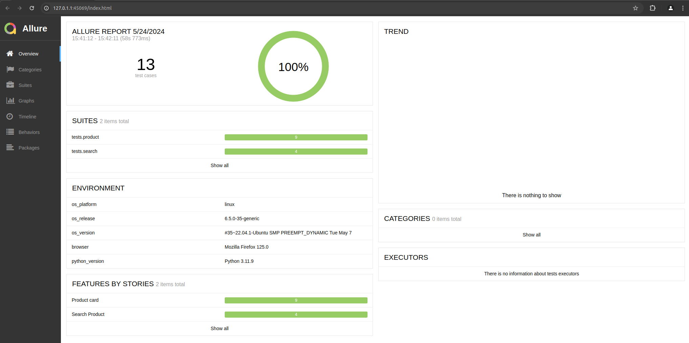

## Praca Zaliczeniowa 2023-2024 
### Uniwersytet WSB Merito we Wrocławiu 
### Studia podyplomowe na kierunku Tester oprogramownia 
# Automatyzacja testów dla sklepu internetowego z wykorzystaniem języka programowania Python, oraz framework Selenium i Pytest 
#### Spis treści
1. [Utworzenie środowiska testowego](#1-utworzenie-środowiska-testowego)
2. [Konfiguracja Allure](#2-uruchomienie-testów)
3. [Uruchomienie testów](#3-uruchomienie-testów)
4. [Generowanie raport z testów](#4-generowanie-raport-z-testów)
5. [Struktura katalogów](#5-struktura-katalogów)
6. [Listing kodu](#6-listing-kodu)

### 1. Utworzenie środowiska testowego
1. Tworzenie środowiska testowego
```bash
python3 -m venv .venv
```
2. Uruchomienie środowiska
```bash
source .venv/bin/active
```
3. Instalacja wymaganych pakietów WAŻNE !! Przed wykonanie tego punktu wykonaj instalację Allure
```bash
pip install --upgrade pip 
pip install -r requirements.txt
pip install -e .
```
### 2. Konfiguracja Allure
1. Pobranie Javy
```bash
sudo apt-get install default-jre
```
2. Instalacja dodatkowych pakietów
```bash
sudo apt install libcanberra-gtk-module libcanberra-gtk3-module
```
3. Instalacja NPM
```bash
sudo apt install npm -y
```
4. Instalacja Allure
```bash
sudo npm install -g allure-commandline --save-dev
```
### 3. Uruchomienie testów
1. W celu uruchomienia testów wpisz w konsoli
```bash
pytest tests/ --alluredir=allure-results
```
### 4. Generowanie raport z testów
1. W celu wygenerowanie raportu z testów w konsoli wpisz
```bash
allure serve allure-results
```
2. Po wygenerowaniu raportu powinna otworzyć się następująca strona

### 5. Struktura katalogów
```bash
├── allure-results/
│   └── environment.properties
├── img/
│   └── img.png
├── src/
│   ├── beti03_source/
│   │   ├── pages/
│   │   ├── __pycache__/
│   │   ├── scripts/
│   │   └── __init__.py
│   └── __init__.py
├── tests/
│   ├── product/
│   │   ├── __init__.py
│   │   ├── test_SC_01_PC_Display_Product_Information.py
│   │   └── test_SC_02_PC_Additional_Information_On_Product_Card.py

│   ├── search/
│   │   ├── __pycache__/
│   │   ├── __init__.py
│   │   ├── test_SC_01_PS_Product_Search_By_Parametrs.py
│   │   └── test_SC_02_PS_Product_Search_By_Global_Search.py
│   └── __init__.py
├── conftest.py
├── __init__.py
├── LICENSE
├── pyproject.toml
├── pytest.ini
├── README.md
├── requirements.txt
├── setup.cfg
└── tmp.txt
```
### 6. Listing kodu
1. SC_01_PS_Product_Search_By_Parametrs
```python
import pytest
import allure
from allure_commons.types import AttachmentType
from selenium.webdriver.common.by import By
from selenium.webdriver.support.ui import WebDriverWait
from selenium.webdriver.support import expected_conditions as EC
from beti03_source.pages.locators import Search_Locators, Page_Locators
from beti03_source.scripts.function import convert_data_to_a_new_temporary_list


@allure.epic('Search Product')
@allure.suite("Search for a product by parameter")
class Test_SC_01_PS_Product_Search_By_Parametrs:
    CAPACITY_LIST = (By.XPATH, Search_Locators.CAPACITY_LIST)
    CATEGORY_PRODUCTS_LIST = (By.XPATH, Page_Locators.CATEGORY_PRODUCTS_LIST)
    SWATCH_LINK_COLOR = (By.XPATH, Search_Locators.SWATCH_LINK_COLOR)
    SEARCH_CAPACITY = '130 ml'
    SAERCH_COLOR = 'czarny'
    EXPECTED_RESULT_OF_SEARCH_BY_CAPACITY_ARGUMENT = 1
    EXPECTED_RESULT_OF_SEARCH_BY_COLOR_ARGUMENT = 9

    @allure.testcase('', 'SC_01_PS_TC_01 Product search by capacity')
    @allure.severity(allure.severity_level.NORMAL)
    @allure.label("owner", "Beti03")
    @pytest.mark.usefixtures("set_side_on_cups")
    def test_SC_01_PS_TC_01_Product_Search_By_Capacity(self):
        """
        CEL: Sprawdzenie czy po wybraniu pojemności "130 ml" w menu "Szukaj po parametrze" zostanie zwrócona odpowienia liczba produktów na stronie. 
            WARUNKI WSTĘPNE: 
                1. Strona ustawiona na http://www.kubki-reklamowe.eu/filizanki-reklamowe-z-logo.html 
            KROKI: 
            1. Znajdź nagłówek o nazwie "Szukaj po parametrze" 
            2. Znajdź tytuł "Pojemność w ml" i zaznacz parametr o wartości "130 ml" i kliknij enter 
            2. Sprawdz czy na stronie zostały wyświetlone produkty 
            3. Zlicz ilość wyświetlonych produktów 
            REZULTAT: 
            1. Na stronie zostanie wyświetlony 1 produkt 
        """
        list_of_available_capacities = self.driver.find_elements(*self.CAPACITY_LIST)
        tmp_elements_list = convert_data_to_a_new_temporary_list(list_of_available_capacities)
        counter_counting_the_position_of_the_search_query = 0
        for i in range(len(tmp_elements_list)):
            if tmp_elements_list[i] != self.__class__.SEARCH_CAPACITY:
                counter_counting_the_position_of_the_search_query += 1
            else:
                capacity_item_xpath = f"//dl[@id='narrow-by-list']/dd[@class='last even']/ol/li[{counter_counting_the_position_of_the_search_query}]"
                capacity_item_id_in_the_list = self.driver.find_element(By.XPATH, capacity_item_xpath)
                self.driver.implicitly_wait(10)
                capacity_item_id_in_the_list.click()
                WebDriverWait(self.driver, 150).until(
                    EC.visibility_of_element_located((By.XPATH, "//div[@class='category-products']/ul/li"))
                )
                self.driver.implicitly_wait(50)
                products_find = self.driver.find_elements(self.__class__.CATEGORY_PRODUCTS_LIST)
                vissible_products = [item for item in products_find if item.is_displayed()]
                product_item_count = len(vissible_products)
                assert product_item_count == self.__class__.EXPECTED_RESULT_OF_SEARCH_BY_CAPACITY_ARGUMENT
                allure.attach(self.driver.get_screenshot_as_png(), name='Product Search By Capacity',
                              attachment_type=AttachmentType.PNG)

    @allure.testcase('', 'SC_01_PS_TC_02 Product search by black color')
    @allure.severity(allure.severity_level.NORMAL)
    @allure.label("owner", "Beti03")
    @pytest.mark.usefixtures("set_side_on_mugs")
    def test_SC_01_PS_TC_02_Product_Search_By_Black_Color(self):
        """
        CEL: Sprwadzenie czy zostanie zwrócony produkt/y do którego przypisany jest atrybut koloru czarnego
            WARUNKI WSTĘPNE:
            1. Strona ustawiona na http://www.kubki-reklamowe.eu/polska-ceramika-reklamowa.html
            KROKI:
            1. Znajdź nagłówek o nazwie "Szukaj po parametrze"
            2. Znajdź nagłówek o nazwie "Kolor" i kliknij w kwadrat w kolorze "czarnym"
            3. Sprawdź czy na stronie zostały wyśwetlone produkty
            4. Zlicz ilość wyświetlonych produktów
            REZULTAT:
            1. Na stronie zostanie wyświetlonych 9 produktów
        :return:
        """

        color_links = self.driver.find_elements(*self.SWATCH_LINK_COLOR)
        # Utwórz listę kolorów na podstawie atrybutu title
        color_titles = [link.get_attribute("title") for link in color_links]
        # # Kliknij każdy link i zweryfikuj wynik (np. załaduj stronę)
        for color in color_titles:
            if color == self.__class__.SAERCH_COLOR:
                link = WebDriverWait(self.driver, 10).until(
                    EC.presence_of_element_located((By.XPATH, f"//img[@title='{color}']/ancestor::a"))
                )
                # Kliknij link
                link.click()
                self.driver.implicitly_wait(50)
                products_find = self.driver.find_elements(*self.CATEGORY_PRODUCTS_LIST)
                vissible_products = [item for item in products_find if item.is_displayed()]
                product_item_count = len(vissible_products)
                assert product_item_count == self.__class__.EXPECTED_RESULT_OF_SEARCH_BY_COLOR_ARGUMENT
                allure.attach(self.driver.get_screenshot_as_png(), name='Product Search By Black Color',
                              attachment_type=AttachmentType.PNG)

```
2. SC_02_PS_Product_Search_By_Global_Search
```python
import pytest
import allure
from allure_commons.types import AttachmentType
from selenium.webdriver.common.by import By
from selenium.webdriver.support.ui import WebDriverWait
from selenium.webdriver.support import expected_conditions as EC
from beti03_source.pages.locators import Page_Locators, Message_Page_Locators


@allure.epic("Search Product")
@allure.suite("Product search by global search")
class Test_SC_02_PS_Product_Search_By_Global_Search:
    PAGE_TITLE = (By.XPATH, Page_Locators.PAGE_TITLE)
    NOTE_MSG = (By.XPATH, Message_Page_Locators.NOTE_MSG)
    CATEGORY_PRODUCTS_LIST = (By.XPATH, Page_Locators.CATEGORY_PRODUCTS_LIST)
    GLOBAL_SEARCH = (By.XPATH, Page_Locators.GLOBAL_SEARCH)
    PRODUCT_NAME_H2 = (By.XPATH, Page_Locators.PRODUCT_NAME_H2)
    FIND_WORD = 'kufel'
    FIND_FAKE_WORD = 'kafel'
    EXPECTED_RESULT_PRODUCT_COUNT = 9
    EXPECTED_SEARCH_MSG = 'Brak wyników wyszukiwania.'
    EXPECTED_SEARCH_RESULT = "Wyniki wyszukiwania dla 'kafel'"
    @allure.testcase('',"SC_02_PS_TC_01 Product search by word")
    @allure.severity(allure.severity_level.NORMAL)
    @allure.label("owner", "Beti03")
    @pytest.mark.usefixtures("set_side_on_home_page")
    def test_SC_02_PS_TC_01_Product_Search_By_Word(self):
        """
        CEL: Sprawdzenie czy po wpisaniu frazy "kufel" zostaną wyświetlone produkty, które mają w tytule "Kufel"
            WARUNKI WSTĘPNE:
            1. Strona ustawiona na http://www.kubki-reklamowe.eu
            KROKI:
            1. W pasku wyszukiwania wpisza frazę "kufel" i kliknij enter
            2. Sprawdź czy w zwróconych towarach jest szykane słowo
            3. Zlicz ilość wyświetlonych produktów
            REZULTAT:
            1. Każdy wyświetlony produkt posiada w nazwie słowo "kufel"
            2. Zostanie zwrócone 9 pozycji
        """
        global_search = self.driver.find_element(*self.GLOBAL_SEARCH)
        global_search.send_keys(*self.FIND_WORD)
        search_button = WebDriverWait(self.driver, 10).until(
            EC.presence_of_element_located((By.XPATH, "//div[@class='form-search']/button[@class='button']"))
        )
        search_button.click()
        WebDriverWait(self.driver, 25).until(
            EC.presence_of_element_located((By.XPATH, "//div[@class='category-products']"))
        )
        tmp_product_names_list = []
        product_find = self.driver.find_elements(*self.PRODUCT_NAME_H2)
        for i in range(len(product_find)):
            tmp_product_names_list.append(str(product_find[i].text))
        convert_to_sting = ' '.join(tmp_product_names_list).lower()
        create_to_tmp_list = convert_to_sting.split(' ')
        create_new_product_names_list = [element for element in create_to_tmp_list if element == self.__class__.FIND_WORD]
        assert len(create_new_product_names_list) == self.EXPECTED_RESULT_PRODUCT_COUNT
        allure.attach(self.driver.get_screenshot_as_png(), name='Product Search By Word',
                      attachment_type=AttachmentType.PNG)

    @allure.testcase("","SC_02_PS_TC_02 Product search by wrong product name")
    @allure.severity(allure.severity_level.NORMAL)
    @allure.label("owner", "Beti03")
    @pytest.mark.usefixtures("set_side_on_home_page")
    def test_SC_02_PS_TC_02_Product_Search_By_Wrong_Product_Name(self):
        """
        CEL: Sprawdzenie czy po wpisaniu błędnej frazy "kafel" zostaną wyświetlone komunikat o treści "Brak wyników wyszukiwania. "
            WARUNKI WSTĘPNE:
            1. Strona ustawiona na http://www.kubki-reklamowe.eu
            KROKI:
            1. W pasku wyszukiwania wpisza frazę "kafel" i kliknij enter
            2. Sprawdź czy na wyświetlonej stronie wyświetlił się tytuł "Wyniki wyszukiwania dla 'kafel'"
            3. Sprawdź czy na stronie wyświetlił się komunikat o treści "Brak wyszukiwania. "
            REZULTAT:
            1. Po wpisaniu frazu, której nie ma w bazie zostanie wyświetlony tytuł "Wyniki wyszukiwania dla 'kafel'"
            2. Po wpisaniu frazu, której nie ma w bazie zostanie wyświetlony komunikat o treści "Brak wyszukiwania. "
        """
        global_search = self.driver.find_element(*self.GLOBAL_SEARCH)
        global_search.send_keys(*self.FIND_FAKE_WORD)
        search_button = WebDriverWait(self.driver, 25).until(
            EC.visibility_of_element_located((By.XPATH, "//div[@class='form-search']/button[@class='button']"))
        )
        search_button.click()
        WebDriverWait(self.driver, 10).until(
            EC.visibility_of_element_located((By.XPATH, "//div[@class='page-title']"))
        )
        search_results = self.driver.find_element(*self.PAGE_TITLE)
        search_msg = self.driver.find_element(*self.NOTE_MSG)
        assert search_msg.text == self.EXPECTED_SEARCH_MSG
        assert search_results.text == self.EXPECTED_SEARCH_RESULT
        allure.attach(self.driver.get_screenshot_as_png(), name='Product Search By Wrong Product Name',
                      attachment_type=AttachmentType.PNG)

```
3. SC_01_PC_Display_Product_Information
```python
import pytest
import allure
from allure_commons.types import AttachmentType
from selenium.webdriver.common.by import By
from selenium.webdriver.support.ui import WebDriverWait
from selenium.webdriver.support import expected_conditions as EC
from beti03_source.pages.locators import Product_Page_Locators

@allure.epic('Product card')
@allure.suite("Display product information")
@pytest.mark.usefixtures("set_side_on_product_page")
class Test_SC_01_PC_Display_Product_Information:
    PRODUCT_TITLE = (By.XPATH, Product_Page_Locators.PRODUCT_TITLE)
    PRICE_BOX_PRICE = (By.XPATH, Product_Page_Locators.PRICE_BOX_PRICE)
    PRODUCT_STATUS = (By.XPATH, Product_Page_Locators.PRODUCT_STATUS)
    EXPECTED_PRODUCT_TITLE = "Kubek ceramiczny HANDY SUPREME ® 300ml"
    EXPECTED_PRODUCT_PRICE = "15,08 zł"
    EXPECTED_STATUS = "W magazynie"
    @allure.testcase('', 'SC_01_PC_TC_01 Product name')
    @allure.severity(allure.severity_level.NORMAL)
    @allure.label("owner", "Beti03")
    @allure.severity(allure.severity_level.NORMAL)
    def test_SC_01_PC_TC_01_Product_Name(self):
        """
        CEL: Sprawdzenie czy na stronie produktu wyświetla się nazwa produktu
            WARUNKI WSTĘPNE:
            1. Strona ustawiona na http://www.kubki-reklamowe.eu/polska-ceramika-reklamowa/kubek-ceramiczny-handy-supreme-r-300ml.html
            KROKI:
            1. Znajdź nazwę produktu "Kubek ceramiczny HANDY SUPREME ® 300ml"
            REZULTAT:
            1. Na stronie z wyświetlony produkt będzie posiadał nazwę "Kubek ceramiczny HANDY SUPREME ® 300ml"
        """
        product_name_on_page = self.driver.find_element(*self.PRODUCT_TITLE)
        assert product_name_on_page.text == self.EXPECTED_PRODUCT_TITLE
        allure.attach(self.driver.get_screenshot_as_png(), name='Product Name',
                      attachment_type=AttachmentType.PNG)
    @allure.testcase('', 'SC_01_PC_TC_02 Product Price')
    @allure.severity(allure.severity_level.NORMAL)
    @allure.label("owner", "Beti03")
    @allure.severity(allure.severity_level.NORMAL)
    def test_SC_01_PC_TC_02_Product_Price(self):
        """
        CEL: Sprawdzenie czy na stronie produktu wyświetla się cena produktu
            WARUNKI WSTĘPNE:
            1. Strona ustawiona na http://www.kubki-reklamowe.eu/polska-ceramika-reklamowa/kubek-ceramiczny-handy-supreme-r-300ml.html
            KROKI:
            1. Znajdź cenę produktu "15,08 zł"
            REZULTAT:
            1. Na stronie z wyświetlony produkt będzie posiadał cenę "15,08 zł"
        """
        product_price = self.driver.find_element(*self.PRICE_BOX_PRICE)
        assert product_price.text == self.EXPECTED_PRODUCT_PRICE
        allure.attach(self.driver.get_screenshot_as_png(), name='Product Price',
                      attachment_type=AttachmentType.PNG)
    @allure.testcase('', 'SC_01_PC_TC_03 Product Availability')
    @allure.severity(allure.severity_level.NORMAL)
    @allure.label("owner", "Beti03")
    @allure.severity(allure.severity_level.NORMAL)
    def test_SC_01_PC_TC_03_Product_Availability(self):
        """
        CEL: Sprawdzenie czy na stronie produktu wyświetla stan magazynowy
            WARUNKI WSTĘPNE:
            1. Strona ustawiona na http://www.kubki-reklamowe.eu/polska-ceramika-reklamowa/kubek-ceramiczny-handy-supreme-r-300ml.html
            KROKI:
            1. Znajdź dostępność produktu
            REZULTAT:
            1. Na stronie produkt widnieć będzie informacja o dostępności towaru "W magazynie"
        """
        product_status = self.driver.find_element(*self.PRODUCT_STATUS)
        assert product_status.text == self.EXPECTED_STATUS
        allure.attach(self.driver.get_screenshot_as_png(), name='Product Availability',
                      attachment_type=AttachmentType.PNG)
    @allure.testcase('', 'SC_01_PC_TC_04 Product Image Displayed')
    @allure.severity(allure.severity_level.NORMAL)
    @allure.label("owner", "Beti03")
    @allure.severity(allure.severity_level.NORMAL)
    def test_SC_01_PC_TC_04_Product_Image_Displayed(self):
        """
        CEL: Sprawdzenie czy na stronie produktu wyświetla się zdjęcia produktu
            WARUNKI WSTĘPNE:
            1. Strona ustawiona na http://www.kubki-reklamowe.eu/polska-ceramika-reklamowa/kubek-ceramiczny-handy-supreme-r-300ml.html
            KROKI:
            1. Znajdź zdjęcie produktu
            REZULTAT:
            1. Na stronie produkt bedzie widoczne zdjęcie produkty
        """
        image = WebDriverWait(self.driver, 10).until(EC.visibility_of_element_located((By.ID, "image-main")))
        image_src = image.get_attribute("src")
        assert image_src and image_src != ""
        allure.attach(self.driver.get_screenshot_as_png(), name='Product Image Displayed',
                      attachment_type=AttachmentType.PNG)
```
4. SC_02_PC_Additional_Information_On_Product_Card
```python
import pytest
import allure
from allure_commons.types import AttachmentType
from selenium.webdriver.common.by import By
from beti03_source.pages.locators import Product_Page_Locators

@allure.epic('Product card')
@allure.suite("Additional information on product card")
@pytest.mark.usefixtures("set_side_on_product_page")
class Test_SC_02_PC_Additional_Information_On_Product_Card:
    TAB_DESCRIPTION = (By.XPATH, Product_Page_Locators.TAB_DESCRIPTION)
    TAB_ADDITIONAL = (By.XPATH, Product_Page_Locators.TAB_ADDITIONAL)
    TAB_TABREVIEWS = (By.XPATH, Product_Page_Locators.TAB_TABREVIEWS)
    TAB_TAGS = (By.XPATH, Product_Page_Locators.TAB_TAGS)
    TAB_PRODUCT_CMS_BLOCK1 = (By.XPATH, Product_Page_Locators.TAB_PRODUCT_CMS_BLOCK1)
    EXPECTED_RESULT_TAB_DESCRIPTION = "Opis produktu"
    EXPECTED_RESULT_TAB_ADDITIONAL = "Informacje dodatkowe"
    EXPECTED_RESULT_TAB_TABREVIEWS = "Recenzje"
    EXPECTED_RESULT_TAB_TAGS = "Tagi produktu"
    EXPECTED_RESULT_TAB_PRODUCT_CMS_BLOCK1 = "Dodatkowe opcje znakowania"

    @allure.testcase('', 'SC_03_PC_TC_01 Visible product description tab')
    @allure.severity(allure.severity_level.NORMAL)
    @allure.label("owner", "Beti03")
    @allure.severity(allure.severity_level.NORMAL)
    def test_SC_02_PC_TC_01_Visible_Product_Description_Tab(self):
        """
        CEL: Sprawdzenie czy wyświetla się na zakładce napis "Opis produktu"
            WARUNKI WSTĘPNE:
            1. Strona ustawiona na http://www.kubki-reklamowe.eu/polska-ceramika-reklamowa/kubek-ceramiczny-handy-supreme-r-300ml.html
            KROKI:
            1. Znajdź zakłądkę na dole strony o tytule "Opis produktu"
            REZULTAT:
            1. Na stronie jest widoczna zakładka o tytule "Opis produktu"
        """
        description_tab = self.driver.find_element(*self.TAB_DESCRIPTION)
        assert description_tab.text == self.EXPECTED_RESULT_TAB_DESCRIPTION
        allure.attach(self.driver.get_screenshot_as_png(), name='Visible Product Description Tab',
                      attachment_type=AttachmentType.PNG)
    @allure.testcase('', 'SC_03_PC_TC_02 Visible additional information tab')
    @allure.severity(allure.severity_level.NORMAL)
    @allure.label("owner", "Beti03")
    @allure.severity(allure.severity_level.NORMAL)
    def test_SC_02_PC_TC_02_Visible_Additional_Information_Tab(self):
        """
        CEL: Sprawdzenie czy wyświetla się na zakładce napis "Informacje dodatkowe"
            WARUNKI WSTĘPNE:
            1. Strona ustawiona na http://www.kubki-reklamowe.eu/polska-ceramika-reklamowa/kubek-ceramiczny-handy-supreme-r-300ml.html
            KROKI:
            1. Znajdź zakłądkę na dole strony o tytule "Informacje dodatkowe"
            REZULTAT:
            1. Na stronie jest widoczna zakładka o tytule "Informacje dodatkowe"
        """
        additional_information_tab = self.driver.find_element(*self.TAB_ADDITIONAL)
        assert additional_information_tab.text == self.EXPECTED_RESULT_TAB_ADDITIONAL
        allure.attach(self.driver.get_screenshot_as_png(), name='Visible Additional Information Tab',
                      attachment_type=AttachmentType.PNG)
    @allure.testcase('', 'SC_03_PC_TC_03 Visible reviews tab')
    @allure.severity(allure.severity_level.NORMAL)
    @allure.label("owner", "Beti03")
    @allure.severity(allure.severity_level.NORMAL)
    def test_SC_02_PC_TC_03_Visible_Reviews_Tab(self):
        """
        CEL: Sprawdzenie czy wyświetla się na zakładce napis "Recenzje"
            WARUNKI WSTĘPNE:
            1. Strona ustawiona na http://www.kubki-reklamowe.eu/polska-ceramika-reklamowa/kubek-ceramiczny-handy-supreme-r-300ml.html
            KROKI:
            1. Znajdź zakłądkę na dole strony o tytule "Recenzje"
            REZULTAT:
            1. Na stronie jest widoczna zakładka o tytule "Recenzje"
        """
        reviews_tab = self.driver.find_element(*self.TAB_TABREVIEWS)
        assert reviews_tab.text == self.EXPECTED_RESULT_TAB_TABREVIEWS
        allure.attach(self.driver.get_screenshot_as_png(), name='Visible Reviews Tab',
                      attachment_type=AttachmentType.PNG)

    @allure.testcase('', 'SC_03_PC_TC_05 Visible product description sheet product tags')
    @allure.severity(allure.severity_level.NORMAL)
    @allure.label("owner", "Beti03")
    @allure.severity(allure.severity_level.NORMAL)
    def test_SC_02_PC_TC_04_Visible_Product_Description_Sheet_Product_Tags(self):
        """
        CEL: Sprawdzenie czy wyświetla się na zakładce napis "Tagi produktu"
            WARUNKI WSTĘPNE:
            1. Strona ustawiona na http://www.kubki-reklamowe.eu/polska-ceramika-reklamowa/kubek-ceramiczny-handy-supreme-r-300ml.html
            KROKI:
            1. Znajdź zakłądkę na dole strony o tytule "Tagi produktu"
            REZULTAT:
            1. Na stronie jest widoczna zakładka o tytule "Tagi produktu"
        """
        product_tags_tab = self.driver.find_element(*self.TAB_TAGS)
        assert product_tags_tab.text == self.EXPECTED_RESULT_TAB_TAGS
        allure.attach(self.driver.get_screenshot_as_png(), name='Visible Product Description Sheet Product Tags',
                      attachment_type=AttachmentType.PNG)
    @allure.testcase('', 'SC_03_PC_TC_05 Visible description card add mark options')
    @allure.severity(allure.severity_level.NORMAL)
    @allure.label("owner", "Beti03")
    @allure.severity(allure.severity_level.NORMAL)
    def test_SC_02_PC_TC_05_Visible_Description_Card_Add_Mark_Options(self):
        """
        CEL: Sprawdzenie czy wyświetla się na zakładce napis "Dodatkow opcje znakowania"
            WARUNKI WSTĘPNE:
            1. Strona ustawiona na http://www.kubki-reklamowe.eu/polska-ceramika-reklamowa/kubek-ceramiczny-handy-supreme-r-300ml.html
            KROKI:
            1. Znajdź zakłądkę na dole strony o tytule "Dodatkow opcje znakowania"
            REZULTAT:
            1. Na stronie jest widoczna zakładka o tytule "Dodatkow opcje znakowania"
        """
        add_mark_options_tab = self.driver.find_element(*self.TAB_PRODUCT_CMS_BLOCK1)
        assert add_mark_options_tab.text == self.EXPECTED_RESULT_TAB_PRODUCT_CMS_BLOCK1
        allure.attach(self.driver.get_screenshot_as_png(), name='Visible Description Card Add Mark Options',
                      attachment_type=AttachmentType.PNG)

```